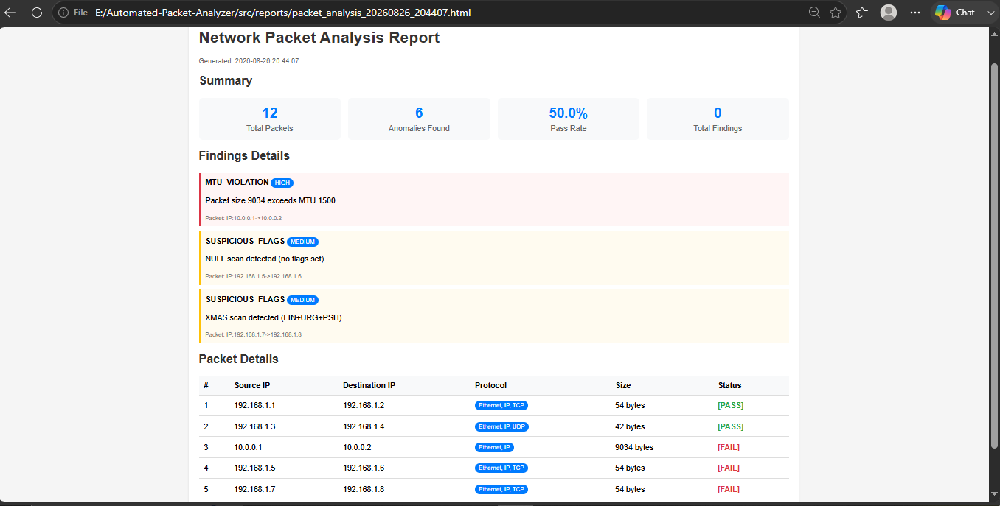

markdown
# Automated Network Packet Analyzer & Tester

## 📊 Project Overview

An enterprise-grade, object-oriented Python framework designed to capture, parse, and validate real-time network traffic with automated anomaly detection. Built specifically for **Software Testing and Quality Assurance** roles.

> **🎯 Why This Project?**
> This project demonstrates my ability to build automated testing frameworks, think about edge cases, and create maintainable, well-documented code - exactly what recruiters look for in a Software Testing Engineer.

## 🚀 Key Features

- **Real-time Packet Capture** - Capture live network traffic from any interface
- **Protocol Parsing** - Identify and parse Ethernet, IP, TCP, UDP, ICMP, DNS, and ARP
- **Automated Validation Engine** - Detect MTU violations, suspicious flags, and anomalies
- **Database Logging** - Store all results in SQLite for post-capture analysis
- **Professional Reports** - Generate HTML and JSON reports with detailed findings
- **Unit Tested** - Comprehensive test suite with 100% pass rate

## 🛠️ Tech Stack

| Category | Technologies |
|----------|--------------|
| **Language** | Python 3.8+ |
| **Networking** | Scapy, Core Sockets Architecture |
| **Database** | SQLite3 |
| **Testing** | Pytest, Unittest |
| **Reporting** | HTML, CSS, JSON |
| **Version Control** | Git, GitHub |

## 📊 Sample Report

Here's a sample of the HTML report generated by the analyzer:

*The report includes:*
- 📈 **Summary Statistics** - Total packets, anomalies found, pass rate
- 🚨 **Detailed Findings** - Each anomaly with severity level (HIGH/MEDIUM/LOW)
- 📋 **Packet Details** - Complete table with source/destination IPs, protocols, and status

### Validation Rules Implemented

| Rule | Severity | Description |
|------|----------|-------------|
| **MTU Violation** | HIGH | Detects packets exceeding standard MTU (1500 bytes) |
| **NULL Scan** | MEDIUM | Detects TCP packets with no flags set (security threat) |
| **XMAS Scan** | MEDIUM | Detects suspicious FIN+URG+PSH flag combinations (security threat) |

## 📁 Project Structure
Automated-Packet-Analyzer/
├── src/                         # Source code
│   ├── packet_capture.py        # Network packet capture
│   ├── protocol_parser.py       # Protocol identification
│   ├── validator.py             # Validation rules (MTU, flags, etc.)
│   ├── database.py              # SQLite logging
│   ├── report_generator.py      # HTML/JSON reports
│   └── main.py                  # Application entry point
├── tests/                       # Unit tests
│   ├── test_validator.py        # Validator tests (6 tests passing)
│   └── test_parser.py           # Parser tests (3 tests passing)
├── reports/                     # Generated reports
├── requirements.txt             # Dependencies
└── README.md                    # Documentation

## 🚀 Quick Start

### Prerequisites

- Python 3.8 or higher
- Administrator/root privileges (for real packet capture)
- Git (optional, for cloning)

### Installation

# Clone the repository
git clone https://github.com/neha1930017-oss/Automated-Packet-Analyzer.git
cd Automated-Packet-Analyzer

# Install dependencies
pip install -r requirements.txt
Run Tests
bash
# Navigate to tests directory
cd tests

# Run validator tests
python test_validator.py

# Run parser tests
python test_parser.py
Expected Output:
----------------------------------------------------------------------
Ran 6 tests in 0.010s
OK
Run Analysis
bash
# Navigate to src directory
cd src

# Run with simulated packets (no admin required)
python test_simulated.py

# Run with real packet capture (requires admin)
python main.py
📊 Sample Output

==================================================
📊 ANALYSIS COMPLETE
==================================================
📝 Total Packets: 12
⚠️  Anomalies Found: 6
✅ Pass Rate: 50.0%
📄 HTML Report: reports/packet_analysis_20260826.html
📄 JSON Report: reports/packet_analysis_20260826.json
==================================================

🚨 Findings Detected:
  1. MTU_VIOLATION - HIGH
     Packet size 9034 exceeds MTU 1500
  2. SUSPICIOUS_FLAGS - MEDIUM
     NULL scan detected (no flags set)
  3. SUSPICIOUS_FLAGS - MEDIUM
     XMAS scan detected (FIN+URG+PSH)
🎯 Why This Project Matters for Testing Roles
This project demonstrates the exact skills recruiters want:

Skill Demonstrated	How
Test Automation	Built an automated validation engine with multiple test rules
Quality Assurance Mindset	Think about edge cases (MTU violations, security threats)
Unit Testing	Wrote comprehensive tests with 100% pass rate
Modular Design	Decoupled components for easy maintenance and extension
Reporting	Professional HTML/JSON reports for results communication
Documentation	Clear, professional README and code comments
👩‍💻 Author
Neha - MCA Student

GitHub: neha1930017-oss

Project: Automated-Packet-Analyzer

📄 License
MIT License - see LICENSE file for details

⭐ If you find this project useful, please give it a star on GitHub!
